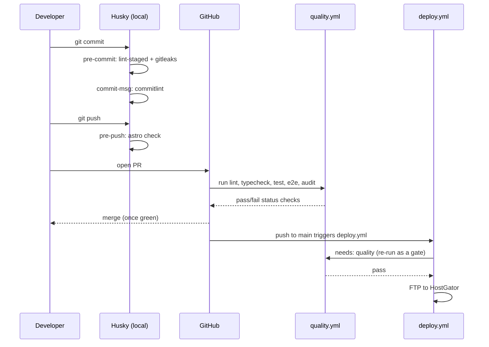

# Contributing

## Local checks

```bash
npm run lint && npm run format:check && npm run stylelint  # code style
npm run typecheck                                           # astro check
npm test                                                    # unit + integration
npm run test:e2e                                            # Playwright smoke suite
```

Git hooks (via Husky) run a subset of these automatically:

- `pre-commit`: lint-staged (eslint/prettier/stylelint --fix on staged files)
  and, if you have [gitleaks](https://github.com/gitleaks/gitleaks#installing)
  installed, a secret scan.
- `commit-msg`: [Conventional Commits](https://www.conventionalcommits.org/)
  via commitlint.
- `pre-push`: `npm run typecheck`.
- `post-merge`: reinstalls dependencies if `package-lock.json` changed.



## Commit messages

`<type>: <description>`, e.g. `fix: correct email validation regex`. Allowed
types come from `@commitlint/config-conventional` (`feat`, `fix`, `chore`,
`docs`, `refactor`, `test`, `ci`, ...).

## CI

Every PR runs `.github/workflows/quality.yml` (lint, typecheck, tests, e2e,
non-blocking audit), plus standalone CodeQL and gitleaks scans. `main` pushes
additionally gate the FTP deploy behind that same quality workflow passing.

## Recommended repo settings (not something I can set from here)

Settings → Branches → branch protection rule for `main`:

- Require a pull request before merging.
- Require status checks to pass before merging - select the `quality.yml`
  jobs (lint, typecheck, test, e2e) plus CodeQL and gitleaks.
- Require branches to be up to date before merging.

This turns the CI gate that already blocks `deploy.yml` into one that also
blocks merging in the first place, closing the "push straight to main"
bypass.
