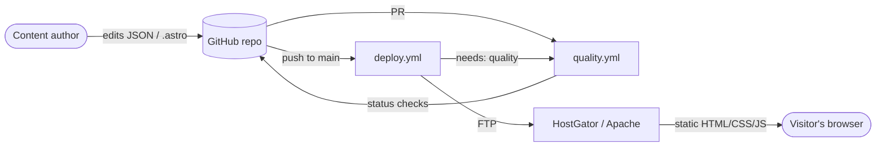

# VZ Book 2026

Victor Zamudio's portfolio site - a dark, retro-terminal-styled walkthrough
of his career ("At the Beginning...", "No one knows...", "Nobody knows he
worked on...", "Nor where to find him..."), built with
[Astro](https://astro.build) and migrated from a Jekyll site.



Full system diagrams (content pipeline, test strategy, quality gates over
time) live in [`docs/architecture.md`](docs/architecture.md).

## Tech stack

- **[Astro 5](https://astro.build)** - static site generation, file-based
  routing, [Content Collections](https://docs.astro.build/en/guides/content-collections/)
  with Zod schemas for all page/project data (`src/content.config.ts`).
- **Sass/SCSS** - one partial per page/section under `src/styles/`.
- **TypeScript** (`astro/tsconfigs/strict`) for `.astro` frontmatter and
  `src/lib/`.
- **[ECharts](https://echarts.apache.org/)**, loaded from a CDN at runtime
  (not bundled - see `IMPROVEMENTS.md`) for the courses charts on
  `no-one-knows/the-server`.
- Deployed by FTP to HostGator (`.github/workflows/deploy.yml`), gated
  behind the CI quality checks passing (see below).

## Setup

```bash
nvm use              # or install Node 18.20.8+ per .nvmrc
npm install           # also installs git hooks via `prepare` (Husky)
npm run dev           # http://localhost:4321
```

## Project structure

```
src/
  pages/              Astro pages (routes) - mostly thin wrappers around
                      components, fed by Content Collections
  layouts/            Default.astro (the shared <head>/<Header>/<Footer>)
  components/         One .astro component per page section
  content/            JSON content, validated by content.config.ts's Zod
    projects/         One JSON file per portfolio project
  styles/             One .scss partial per page/section
  scripts/            Plain JS, imported from page frontmatter (not React/
                      Vue components) - validation.js (contact form),
                      charts.js (the courses charts)
  lib/                Small shared TS helpers (content.ts: getRequiredEntry)
public/               Static passthrough (images, fonts, .htaccess, robots)
test/
  unit/               Vitest, jsdom - src/scripts/*.js
  integration/        Vitest, real astro:content - Content Collection schemas
  e2e/                Playwright - every generated page + axe a11y checks
docs/
  adr/                Architecture Decision Records - why, not just what
  sonarqube.md         SonarQube local/server setup
```

## npm scripts

| Script                                   | What it does                                                                       |
| ---------------------------------------- | ---------------------------------------------------------------------------------- |
| `dev` / `build` / `preview`              | Astro dev server / production build / preview the build                            |
| `typecheck`                              | `astro check` (TypeScript across `.astro` + `.ts`)                                 |
| `lint` / `lint:fix`                      | ESLint (`typescript-eslint` strict + `eslint-plugin-astro`, including a11y rules)  |
| `format` / `format:check`                | Prettier                                                                           |
| `stylelint` / `stylelint:fix`            | Stylelint (SCSS)                                                                   |
| `test` / `test:unit` / `test:coverage`   | Vitest - all tests / unit only / with coverage                                     |
| `test:e2e`                               | Playwright smoke suite against a real build                                        |
| `sonar:up` / `sonar:down` / `sonar:scan` | Local SonarQube via Docker Compose - see `docs/sonarqube.md`                       |
| `lighthouse`                             | Lighthouse CI against a real build (needs `CHROME_PATH` if Chrome isn't on `PATH`) |
| `size`                                   | `size-limit` check on the shipped JS bundle                                        |

Run the full local gate before pushing anything non-trivial:

```bash
npm run lint && npm run format:check && npm run stylelint && npm run typecheck && npm test
```

## Code quality strategy

This project went from zero tooling to a full quality stack in one pass.
The short version, in order of "how early it catches a problem":

1. **Editor/format**: `.editorconfig`, Prettier, Stylelint.
2. **Lint**: ESLint (`typescript-eslint` strict, `eslint-plugin-astro`,
   `eslint-plugin-jsx-a11y` for accessibility).
3. **Git hooks** (Husky): `pre-commit` (lint-staged + gitleaks if
   installed), `commit-msg` (commitlint, Conventional Commits),
   `pre-push` (`typecheck`), `post-merge` (auto `npm install` if the
   lockfile changed).
4. **Tests**: Vitest (unit + Content Collection integration tests) and
   Playwright (e2e smoke + axe accessibility) - see `docs/adr/0004-*`.
5. **CI** (`.github/workflows/quality.yml`): every PR runs lint, format,
   stylelint, typecheck, tests, and e2e. `deploy.yml` calls it as a gate
   before the FTP deploy runs - see `docs/adr/0005-*`.
6. **Static analysis**: CodeQL (`codeql.yml`) and self-hosted SonarQube
   (`docker-compose.sonar.yml`, `docs/sonarqube.md`).
7. **Security**: gitleaks (hook + CI), HTTP security headers in
   `public/.htaccess` - see `docs/adr/0007-*` for the CSP tradeoffs.
8. **Performance**: Lighthouse CI budgets, `size-limit` on shipped JS -
   see `docs/adr/0009-*`.
9. **Governance**: Dependabot, PR/issue templates - see `CONTRIBUTING.md`.

**Why it works this way, not some other way** - every non-obvious
decision (why a Stylelint rule is disabled instead of "fixed", why
`npm audit` doesn't block deploy, why the CSP allows `'unsafe-inline'`,
why the axe check only fails on `critical` violations) is written down in
[`docs/adr/`](docs/adr/README.md). Read those before assuming a relaxed
rule or a non-blocking check is an oversight - it's very likely a
documented tradeoff.

See [`CONTRIBUTING.md`](CONTRIBUTING.md) for the local check commands,
what each git hook does, and the commit message convention.
