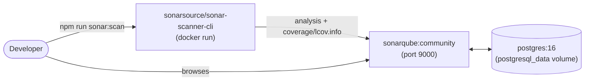

# 6. Self-hosted SonarQube over SonarCloud

## Status

Accepted

## Context

Needed static analysis / code smell / coverage tracking beyond what
ESLint and Stylelint catch (duplicated logic, cognitive complexity,
security hotspots). SonarCloud (SaaS) is the zero-infrastructure option;
self-hosting SonarQube Community Edition requires running and maintaining
a server.

## Decision

Self-hosted SonarQube Community Edition via `docker-compose.sonar.yml`
(SonarQube + Postgres), runnable identically on a local machine or copied
to any VPS later - explicitly requested over SonarCloud. `sonar-project.properties`
points at `src/` and the lcov report `test:coverage` already produces.

Same `docker-compose.sonar.yml` file, unchanged, whether this runs on a
laptop or a VPS - only the reverse proxy/TLS layer in front of it differs
between the two (see `docs/sonarqube.md`).

## Consequences

- No SonarCloud account/billing dependency; full control over data and
  retention.
- Whoever runs this owns keeping the container up to date, backing up the
  `postgresql_data` volume (see `docs/sonarqube.md`), and eventually
  putting it behind a reverse proxy + TLS if it's ever exposed beyond
  `localhost`.
- Not wired into CI yet - deliberately deferred (see `docs/sonarqube.md`)
  to avoid two concurrent PRs editing `quality.yml` at once. The CI job
  is gated on `secrets.SONAR_HOST_URL` existing, so it's a no-op until a
  server is actually deployed somewhere reachable from GitHub Actions.
- Couldn't be tested end-to-end in the sandbox this was built in (no
  Docker available) - config was validated for YAML/JSON correctness and
  against SonarQube's documented compose pattern, but running containers
  and a real scan is still unverified until someone with Docker runs it.
