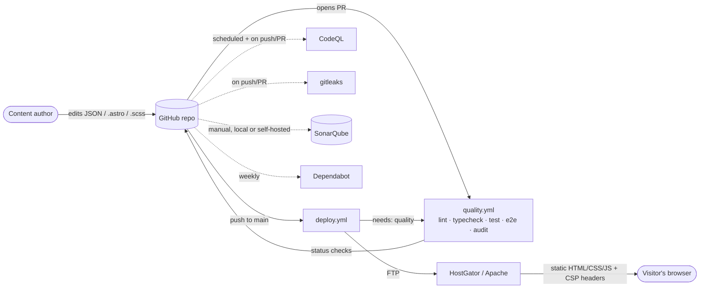
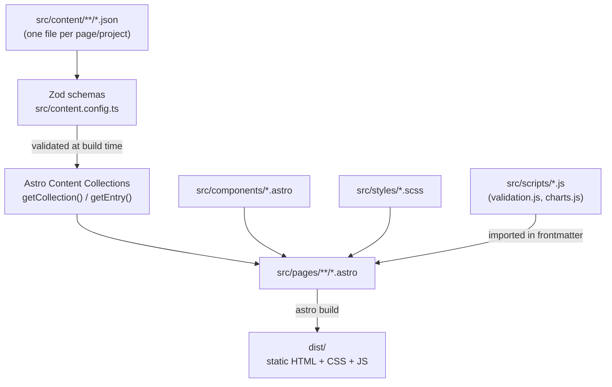
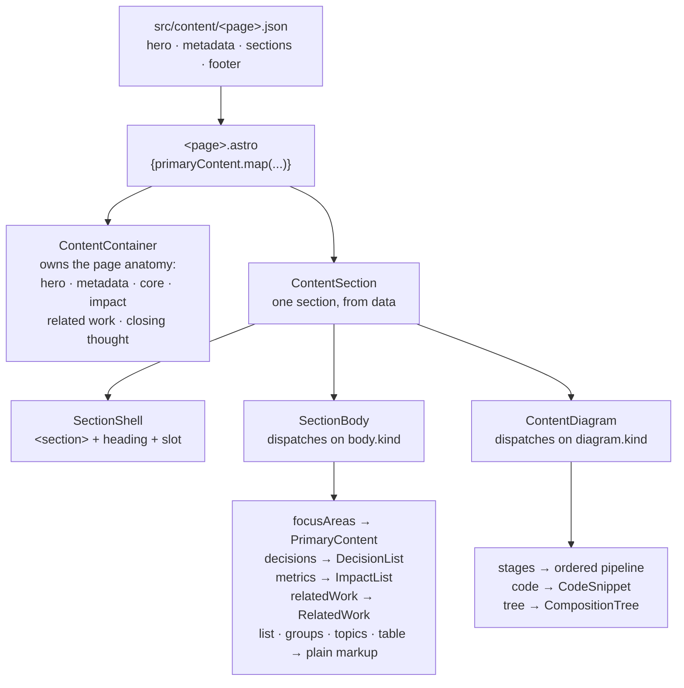
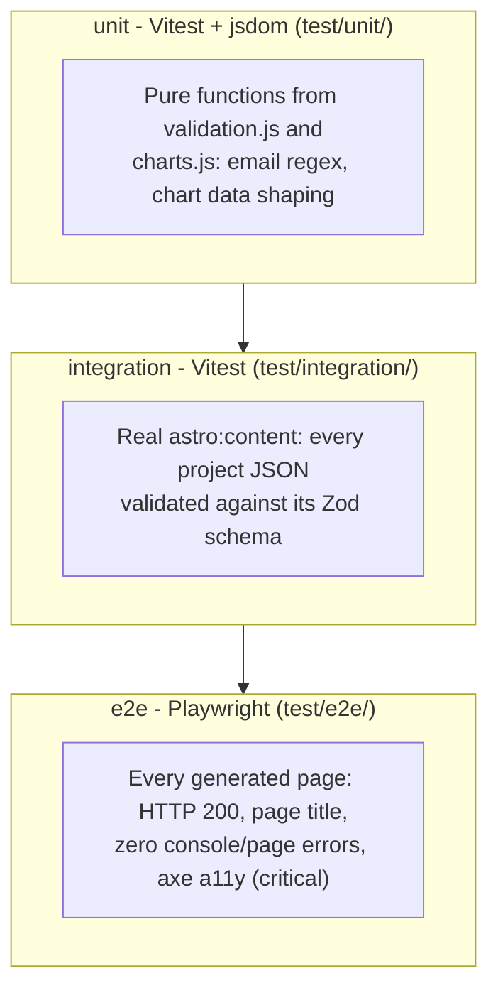
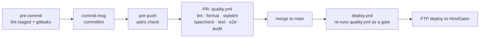

# Architecture

A static Astro site: content authors edit JSON + `.astro` files, CI
validates and tests every change, and only a passing build ever reaches
production. This doc is the visual companion to
[`docs/adr/`](adr/README.md) - diagrams here show _how the pieces fit_;
the ADRs explain _why_ each piece is shaped the way it is.

## System context

Who/what talks to this system, end to end - from a content edit to a
visitor's browser.

Everything to the right of "opens PR" is automated; nothing reaches
`Host` without `Quality` passing first (see
[ADR 0005](adr/0005-ci-quality-gate-blocks-deploy.md)).

## Content → build pipeline

There's no CMS and no server at runtime - every page is fully static,
generated at build time from JSON validated against Zod schemas.

A malformed content JSON fails the _build_, not just a test - Zod
validation runs as part of `astro build`/`astro check` itself, and the
integration tests in `test/integration/` additionally assert the schema
against every real file so a break is caught in CI before it ever reaches
`astro build` in production.

## Book page content

Most pages hand-write their markup and pull only data (a project brief)
from JSON. The "book" pages under `no-one-knows/` are the exception: _all_
of their copy - every paragraph, heading, list, caption - lives in the
page's JSON file, and the `.astro` page only arranges it.
[ADR 0010](adr/0010-book-page-content-as-data.md) covers why, and what it
costs; [ADR 0011](adr/0011-roll-out-book-content-template.md) covers the
rollout.

All eight book sections now use this template - `the-assembly`,
`the-server`, `the-navigator`, `the-fixer`, `the-map`, `the-pattern`,
`the-signal`, and `the-integrator` (`the-server`, `the-navigator` and
`the-fixer` also carry a `coverline` for the index covers).

Every section of such a page shares one skeleton - statement, paragraphs,
body, closing paragraphs, diagram, closing statement - and only the _body_
differs between them. So a page part is a list of sections that the page
maps over, and a `kind` tag on each body picks the component that renders
it.

The two "shell" components (`SectionShell`, `DiagramFigure`) are slotted
primitives: reach for them directly when a section needs one-off markup,
rather than adding a flag to `ContentSection`. `book-content/examples/`
keeps a hand-written version of the same page as reference.

Two body/metadata shapes were added as the template rolled out (see
[ADR 0011](adr/0011-roll-out-book-content-template.md)): a `table` body
`kind` (`{ columns, rows }`) for tabular sections like `the-navigator`'s
career route, and an optional `items` array on `metadata` (term/value
pairs) for pages whose labels do not fit the fixed Role / Focus /
Experience / Scope / Impact set, such as `the-server`.

## Test strategy

Three layers, each catching a different class of regression - see
[ADR 0004](adr/0004-testing-strategy.md) for what's deliberately _not_
covered yet (font 404s, per-project color contrast).

## Quality gates over time

The same change passes through progressively more expensive checks -
cheap and local first, expensive and authoritative last. See
[`CONTRIBUTING.md`](../CONTRIBUTING.md) for the full sequence diagram of
what runs at each git hook.

## Directory map

| Path                                           | What lives here                                                         | Owned by / validated by                                 |
| ---------------------------------------------- | ----------------------------------------------------------------------- | ------------------------------------------------------- |
| `src/pages/`                                   | Routes - thin, mostly just wire Content Collection data into components | `astro check`, e2e smoke                                |
| `src/layouts/`                                 | `BookPage.astro` - shared `<head>`, `Header`, `Footer`, prev/next nav   | e2e smoke (every page uses it)                          |
| `src/components/`                              | One component per page section                                          | ESLint (incl. jsx-a11y), unit tests where logic-bearing |
| `src/components/book-content/`                 | The book-page content template - see [below](#book-page-content)        | ESLint (incl. jsx-a11y), e2e smoke + axe                |
| `src/content/`                                 | JSON content, one file per project/page                                 | Zod schemas in `content.config.ts`, integration tests   |
| `src/styles/`                                  | One SCSS partial per page/section                                       | Stylelint                                               |
| `src/scripts/`                                 | Plain JS (not framework components) - form validation, charts           | Vitest unit tests                                       |
| `src/lib/`                                     | Small shared TS helpers (`content.ts`)                                  | `astro check`                                           |
| `public/`                                      | Static passthrough - images, fonts, `.htaccess`, `robots.txt`           | -                                                       |
| `test/unit/`, `test/integration/`, `test/e2e/` | See [Test strategy](#test-strategy) above                               | -                                                       |
| `docs/adr/`                                    | Why decisions were made                                                 | -                                                       |
| `.github/workflows/`                           | `quality.yml`, `deploy.yml`, `codeql.yml`, `gitleaks.yml`               | -                                                       |

## What this is _not_

Worth stating explicitly, since the diagrams above could otherwise imply
more than exists:

- No server-side runtime - `astro build` outputs pure static files, FTP'd
  to a shared Apache host. No API, no database, no SSR.
- No CDN in front of the site itself (only third-party assets - ECharts,
  Google Fonts - are CDN-loaded, see
  [ADR 0007](adr/0007-security-scanning-and-headers.md)).
- No feature flags, no A/B testing, no analytics wired up yet (the
  previous placeholder script was removed - see the
  `fix: remove broken analytics script placeholder` commit).
